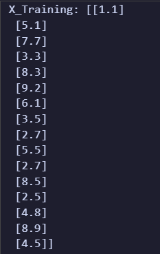

# Implementation-of-Simple-Linear-Regression-Model-for-Predicting-the-Marks-Scored

## AIM:
To write a program to predict the marks scored by a student using the simple linear regression model.

## Equipments Required:
1. Hardware – PCs
2. Anaconda – Python 3.7 Installation / Jupyter notebook

## Algorithm
```
1.Import the standard Libraries.
2.Set variables for assigning dataset values.
3.Import linear regression from sklearn.
4.Assign the points for representing in the graph.
5.Predict the regression for marks by using the representation of the graph.
6.Compare the graphs and hence we obtained the linear regression for the given datas.
```

## Program:
``` python
/*
Program to implement the simple linear regression model for predicting the marks scored.
Developed by: Merryll S Sharon
RegisterNumber:  212222080033
*/

import numpy as np
import pandas as pd
from sklearn.metrics import mean_absolute_error, mean_squared_error
import matplotlib.pyplot as plt
from sklearn.model_selection import train_test_split
from sklearn.linear_model import LinearRegression

df = pd.read_csv("student_scores.csv")

print(df.tail())
print(df.head())
df.info()

x = df.iloc[:, :-1].values  # Hours
y = df.iloc[:,:-1].values   # Scores

x_train, x_test, y_train, y_test = train_test_split(x, y, test_size=1/3, random_state=0)

print("X_Training:", x_train)
print("X_Test:", x_test)
print("Y_Training:", y_train)
print("Y_Test:", y_test)

reg = LinearRegression()
reg.fit(x_train, y_train)

Y_pred = reg.predict(x_test)

print("Predicted Scores:", Y_pred)
print("Actual Scores:", y_test)

a = Y_pred - y_test
print("Difference (Predicted - Actual):", a)

plt.scatter(x_train, y_train, color="green")
plt.plot(x_train, reg.predict(x_train), color="red")
plt.title('Training set (Hours vs Scores)')
plt.xlabel("Hours")
plt.ylabel("Scores")
plt.show()

plt.scatter(x_test, y_test, color="blue")
plt.plot(x_test, reg.predict(x_test), color="green")
plt.title('Testing set (Hours vs Scores)')
plt.xlabel("Hours")
plt.ylabel("Scores")
plt.show()

mae = mean_absolute_error(y_test, Y_pred)
mse = mean_squared_error(y_test, Y_pred)
rmse = np.sqrt(mse)

print("Mean Absolute Error:", mae)
print("Mean Squared Error:", mse)
print("Root Mean Squared Error:", rmse)
```

## Output:
### head():

### tail():


## TRAINING SET INPUT
### X_Training:

### Y_Training:


## TEST SET VALUE
### X_Test (Actual):

### Y_Test (Predicted):

### TRAINING SET:

### TEST SET:

### MEAN SQUARE ERROR, MEAN ABSOLUTE ERROR AND RMSE:


## Result:
Thus the program to implement the simple linear regression model for predicting the marks scored is written and verified using python programming.